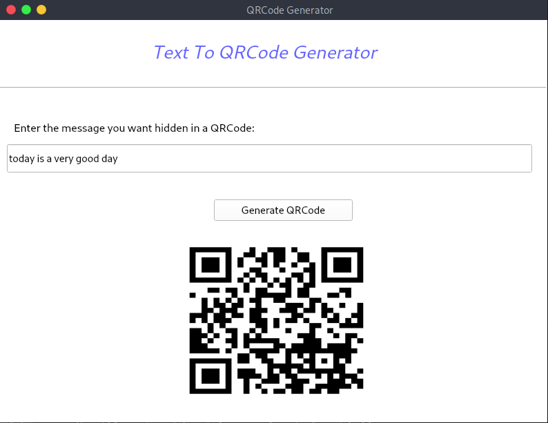

# Message To QRCode Generator
> This program converts a text of any number of words into QRCode and displays the QRCode instantly

## Table of Contents
* [General Info](#general-information)
* [Screenshots](#screenshots)
* [Setup](#setup)
* [Project Status](#project-status)

## General Information
- This project encodes the given message into a qrcode instantly and dsplays the qrcode
- I developed it in order to have an easy to use qrcode generator  
- It saves people time of having to look for a website online to do the same job and it doesn't require an internet connect use it

## Screenshots

## Setup
This project requires PyQt5 and pyqrcode to be installed

## Project Status
Project is: _complete_

